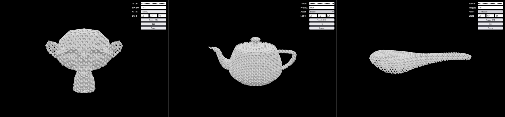

# Example browser application

This app demonstrates combined usage of this three.js addon and the [Metafold SDK for Node.js].



Similar to the [`lattice_infill.js` example][], it runs a number of Metafold API jobs in order to
naively fill a given triangle mesh with a `Gyroid` surface lattice. The final result is a shape
volume that is rendered using a `VolumeRenderPass`.

[Metafold SDK for Node.js]: https://github.com/Metafold3d/metafold-node
[`lattice_infill.js` example]: https://github.com/Metafold3d/metafold-node/blob/master/examples/lattice_infill.js

## Usage

> [!IMPORTANT]
> Using this example may consume import/export tokens from your account.

Run a HTTP server to serve files locally, e.g.:

```
npx serve
```

Or access a hosted version at https://metafold3d.github.io/metafold-three.js/.

### Authentication

As this demo app runs entirely on the client side, we leave the work of secure authentication to the
Metafold app. You can find your secret access token on your [account page][].

We recommend keeping the access token secret in production by storing it securely on the
**server-side only**. This could be done using a framework such as [Next.js](https://nextjs.org/).

For users interested in building an application on the Metafold platform, please contact
[info@metafold3d.com](mailto:info@metafold3d.com). We are currently planning work to enable
third-party applications to initiate login on behalf of Metafold users.

[account page]: https://app.metafold3d.com/account
